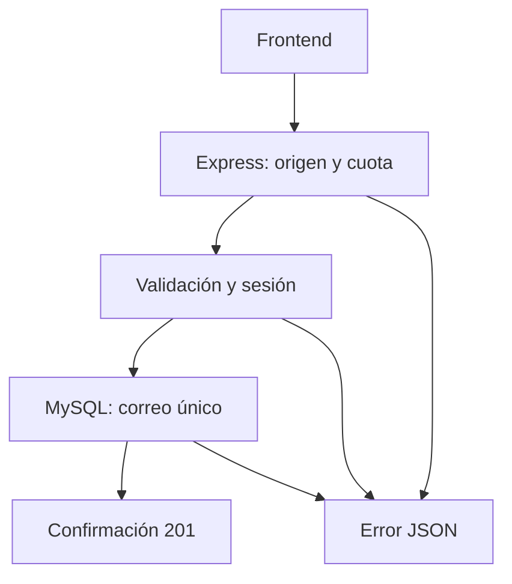

# Arquitectura

## Recorrido principal

## Responsabilidades

- `src/app.ts`: fábrica Express, rutas y hora de recepción.
- `src/server.ts`: arranque y cierre ordenado.
- `src/config/`: MySQL, secreto y orígenes permitidos.
- `src/validators/registration.ts`: validación y normalización.
- `src/services/registration-session.ts`: emisión y verificación HMAC-SHA256.
- `src/services/registration.ts`: comprobación de sesión e inserción.
- `src/middleware/`: cuota compartida y manejo de errores.
- `src/db/`: pools, comprobación y migración.
- `db/migrations/`: esquema SQL versionado.
- `tests/`: pruebas unitarias, HTTP e integración MySQL.
- `scripts/smoke-registration.sh`: recorrido manual con curl.

## Datos y conexiones

La aplicación y los tests de integración usan bases y usuarios separados.
Las consultas de datos son parametrizadas.
MySQL protege la unicidad del correo ante solicitudes simultáneas.

`createApp` permite seleccionar la base y sustituir el reloj para pruebas.
La instancia normal utiliza la base de aplicación.

## Sesiones

El token contiene identificador y fechas, sin datos personales.
La firma permite comprobar alteraciones y el servidor controla el plazo.

La hora de recepción se captura antes de procesar el formulario.
Una espera posterior de MySQL no revoca una solicitud recibida a tiempo.

## Operación

La cuota reside en memoria por proceso.
SIGINT/SIGTERM cierran HTTP y el pool MySQL.
Los detalles y límites están en [Operación](runtime.md).

## Frontend

El adaptador API usará el contrato real.
El adaptador demo conservará los mismos estados con datos simulados.

Reglas de integración: [Frontend](frontend-integration.md).
